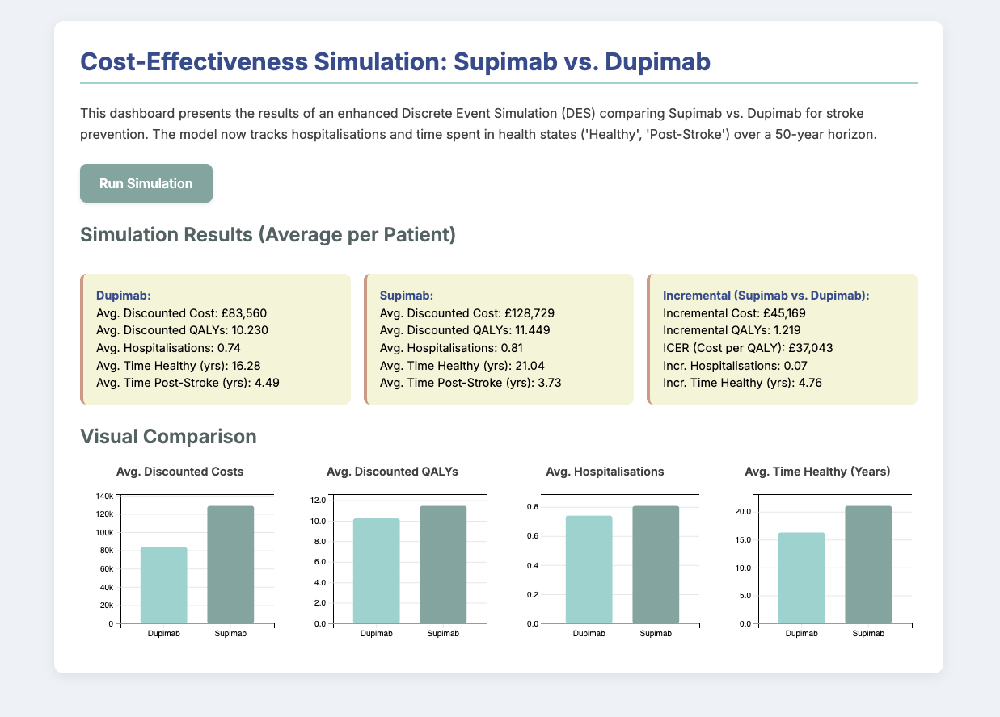
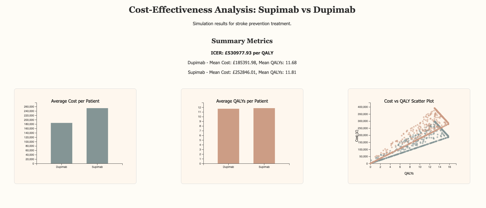
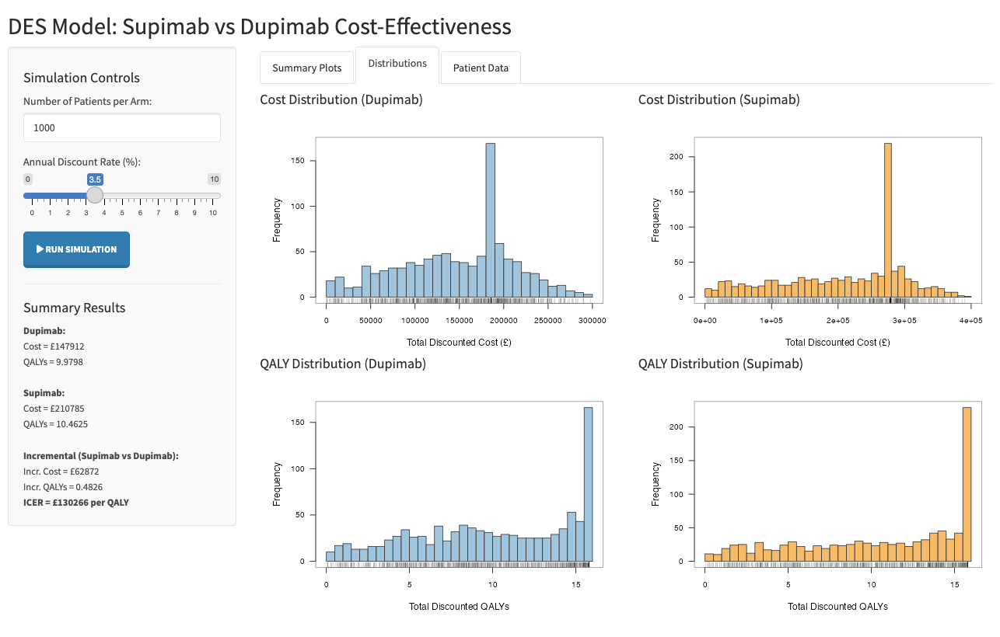

# des-ai-demo: AI-Generated Discrete Event Simulation (DES) Demo

## Project Objective

This project demonstrates and tests the capability of AI coding agents (Gemini and OpenAI models) to generate Discrete Event Simulation (DES) models from minimal prompts. The specific use case involves comparing the cost-effectiveness of a fictional stroke prevention drug (Supimab) against a comparator (Dupimab), inspired by HTA submissions.

**Disclaimer:** These simulations use illustrative fictional parameters and are intended solely as a demonstration of AI code generation for DES modeling. They should not be used for actual decision-making.

## Implementations

This repository contains two separate implementations generated by different AI models:

### Gemini-DES

    * Generated by a Gemini model.
    * Features an interactive, single-file HTML dashboard (`index.html`) using D3.js for visualization and Tailwind CSS for styling (Studio Ghibli inspired).
    * The simulation logic is embedded within the HTML file's JavaScript.
    * Tracks costs, QALYs, strokes, hospitalisations, deaths, and time-in-state.
    * **To Run:** Simply open `gemini-des/index.html` in a web browser and click "Run Simulation".
  

### OPENAI-DES

    * Generated by an OpenAI model.
    * Consists of a Python script (`simulation.py`) to run the simulation and generate `simulation_results.json`, and an HTML dashboard (`index.html`) using D3.js (also Studio Ghibli inspired) to visualize the results from the JSON file.
    * Tracks costs, QALYs, and stroke events, calculating the ICER.
    * **To Run:**
        1.  Run `python openai-des/simulation.py` to generate `simulation_results.json`.
        2.  Serve the `openai-des/` directory using a local web server (e.g., `python -m http.server 8000` inside the `openai-des` folder).
        3.  Open `http://localhost:8000/index.html` (or the appropriate file name and port) in your web browser.

### GEMINI-DES-R
   * Generated with the two models above as inspiration

Made with 🤖 by paul
